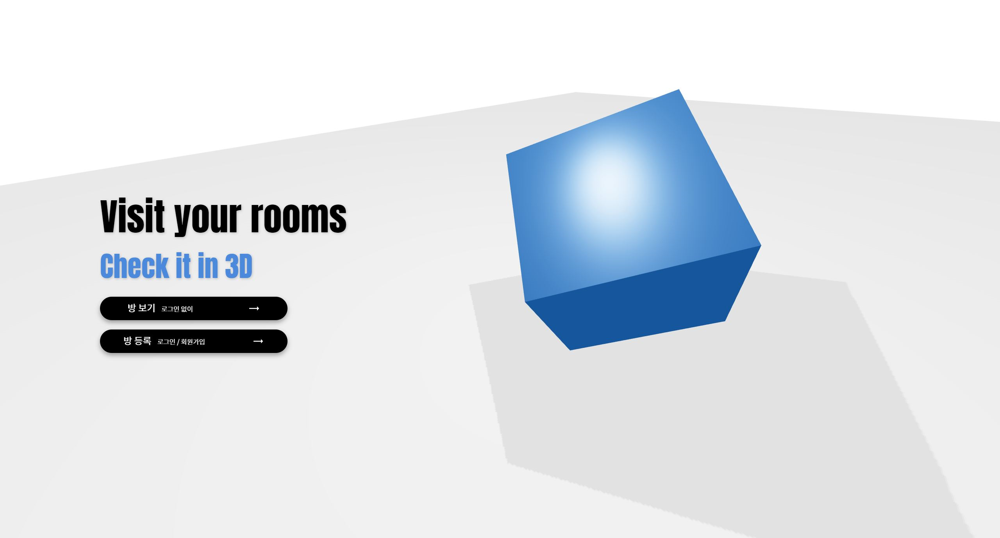

# 실내 공간 3D 종합 데이터를 활용한 가상공간 구축

|김동언|김찬규|신우섭| 이기성  |
|:---:|:---:|:---:|:---:|
|- 3D |- 팀장   - Front-end|- Back-end|- AI |

### Stacks

---

#### Back-end

 

#### Front-end

 

#### AI, Modeling

 

#### Tools

 

---

 

### [User Api]
------------------
1. 회원가입
2. 로그인
3. 토큰 재발급
4. 회원정보수정
5. 회원탈퇴

### [Room Api]
------------------
1. 모든 방 조회
2. 선택한 방 조회
3. 모든 가구 조회

### [Upload Api]
------------------
1. 유저 방 업로드
2. 관리자 방 업로드
